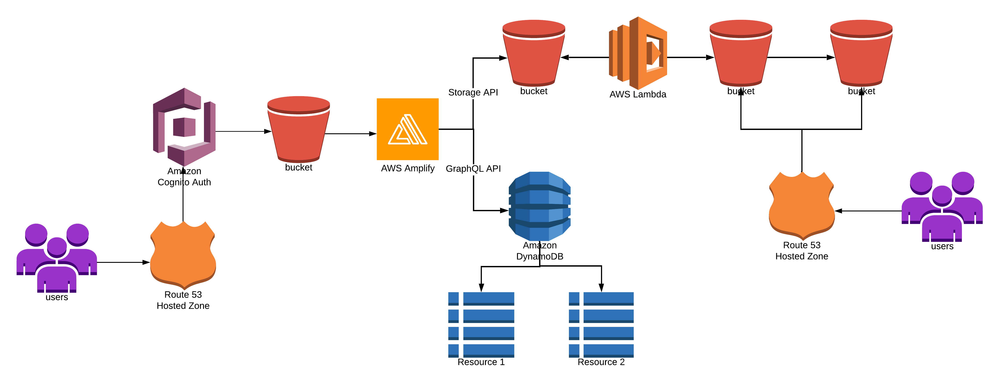
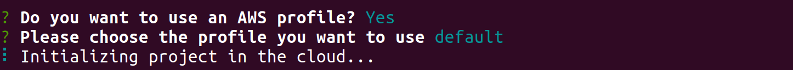
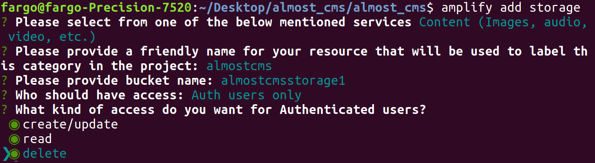
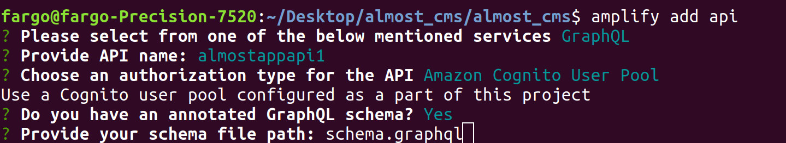

[](http://gkpty.mit-license.org) 

Torus CMS is an open source micro service based serverless content management system (CMS) for building, managing and deploying static sites.  It's fully mobile compatible and provides a friendly GUI  allowing you to easily publish content from any device.   

Torus CMS is standalone and can be added to any static site.  There is no need to migrate your site, learn a new language or do any maintenance.      

**We have ambitious plans for Torus.  Check out our main_project board for more info and updates **   


# How it works 



# Getting Started
    
 ## Pre-requisites

*  Make sure you have node.js and npm installed. You can checkout this [tutorial](https://medium.com/@lucaskay/install-node-and-npm-using-nvm-in-mac-or-linux-ubuntu-f0c85153e173) to install npm and node in mac, linux (debian/ubuntu).
* Have an AWS account. If you don't have an AWS account, you can easily create one [here](https://portal.aws.amazon.com/billing/signup?#/start). Don't worry, everything you do with this project will fall within the AWS free tier limit! 

## Steps
1. Clone the git repository
2. Go into the app directory of the project ` cd almost_cms/almost_cms `
3. Install all dependencies by running ` npm install`
4. Install the amplify cli ` npm install -g @aws-amplify/cli`
5. run the deplyment script `node deployment-script.js`
6. Configure amplify by running ` amplify configure `
    - If you need help with configuration check out this [video tutorial](https://www.youtube.com/watch?v=fWbM5DLh25U)
7. Create a file called .env withe the following variables

    ```
    AWS_ACCESS_KEY_ID=your-access-key
    AWS_SECRET_ACCESS_KEY=your-secret-access-key
    AWS_REGION=us-east-1
    AWS_ACCOUNT_NUMBER=your-aws-account-number
    ```

8. To find your AWS account number, go to the [AWS console support center](https://console.aws.amazon.com/support/home?)

9. Initialize a new amplify project inside your react app ` amplify init `


10. Add authentication ` amplify add auth` use the default configuration
11. Add an S3 storage bucket ` amplify add storage `

12. Add a graphQL API ` amplify add api ` to easily store and retrieve data from dynamoDB 

13. Set up hosting for the amplify app `amplify hosting add `
    
    1. Select ` dev `
    2. For the name of the bucket, enter ` admin.your-domain.com ` replace your-domain.com with your domain..


15. Re-run the deployment script. the name of your storage bucket will contain -dev at the end (dev is the name of your environment).

16. Add a new variable to your .env file containing the api invoke URL `REACT_APP_COPY_BUCKET_URL=your-invoke-url`.


16. Now your ready to publish your app. Run ` amplify publish `

    1. Do you want to generate code for your newly created api? ` No `
    2. Be a bit patient ...

17. Your all set! now you can upload pictures and articles to your static site!

