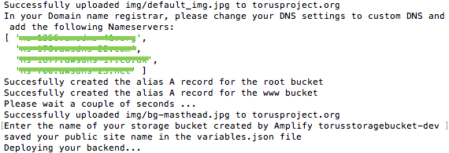
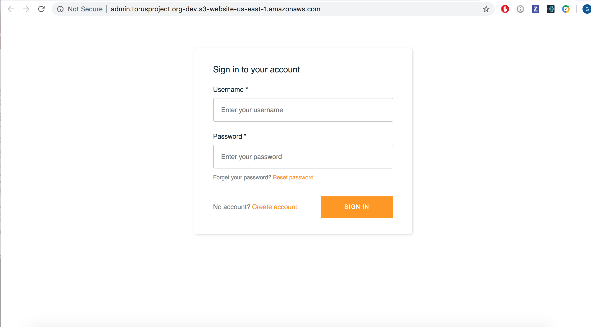

[](http://gkpty.mit-license.org) 
[](https://travis-ci.com/gkpty/torus_cms)
[](https://toruscms.slack.com/)


Torus CMS is an open source micro service based serverless content management system (CMS) for building, managing and deploying static sites in a light, cost-effective way. It's mobile compatible and it provides a friendly GUI, allowing you to easily publish content from any device.   

Torus CMS is standalone and can be added to any static site. There is no need to migrate your site, learn a new language or do any maintenance.     

# How it works 


# Getting Started
    
 ## Pre-requisites

*  Make sure you have node.js and npm installed. You can checkout this [tutorial](https://medium.com/@lucaskay/install-node-and-npm-using-nvm-in-mac-or-linux-ubuntu-f0c85153e173) to install npm and node in mac, linux (debian/ubuntu).
* Have an AWS account. If you don't have an AWS account, you can easily create one [here](https://portal.aws.amazon.com/billing/signup?#/start). Don't worry, everything you do with this project will fall within the AWS free tier limit! 

## Steps
1. Clone the git repository
2. Go into the directory of the project ` cd torus_cms `
3. Install all dependencies by running ` npm install`
4. Install the amplify CLI if you havn't done so already ` npm install -g @aws-amplify/cli`
5. run the deplyment script `node deployment-script.js`
6. Configure amplify by running ` amplify configure `
    - If you need help with configuration check out this [video tutorial](https://www.youtube.com/watch?v=fWbM5DLh25U)
7. Create a file called .env withe the following variables

    ```
    AWS_ACCESS_KEY_ID=your-access-key
    AWS_SECRET_ACCESS_KEY=your-secret-access-key
    AWS_REGION=us-east-1
    AWS_ACCOUNT_NUMBER=your-aws-account-number
    ```

8. To find your AWS account number, go to the [AWS console support center](https://console.aws.amazon.com/support/home?)

9. Initialize a new amplify project inside your react app ` amplify init `


10. Add authentication ` amplify add auth` use the default configuration
11. Add an S3 storage bucket ` amplify add storage `
 ** you can use the space bar to select multiple options
12. Add a graphQL API ` amplify add api ` to easily store and retrieve data from dynamoDB 

13. Set up hosting for the amplify app `amplify hosting add `
    
    1. Select ` dev `
    2. For the name of the bucket, enter ` admin.your-domain.com ` replace your-domain.com with your domain.

15. Re-run the deployment script. Add a -dev at the end of the name your sotrage bucket (e.g. yourstorage-bucket-dev). this assumes you named your environment dev.

16. Make sure to change the nameservers in your domain's DNS settings to use the four nameservers from route 53. This step will vary depending on your domain name registrar.



16. Add a two more variables to your .env file containing your API's invoke URL and your website's url. 
```
REACT_APP_COPY_BUCKET_URL=your-invoke-url
REACT_APP_SITE_URL=http://your-domain.com
```

16. Now your ready to publish your app. Run ` amplify publish `

    1. Do you want to generate code for your newly created api? ` No `
    2. Be a bit patient ...

17. Your all set! now you can upload pictures and articles to your static site!


18. Instead of publishing the admin app you can also only publish the backend by running ` amplify push ` then you can run the app locally with ` npm start ` 

